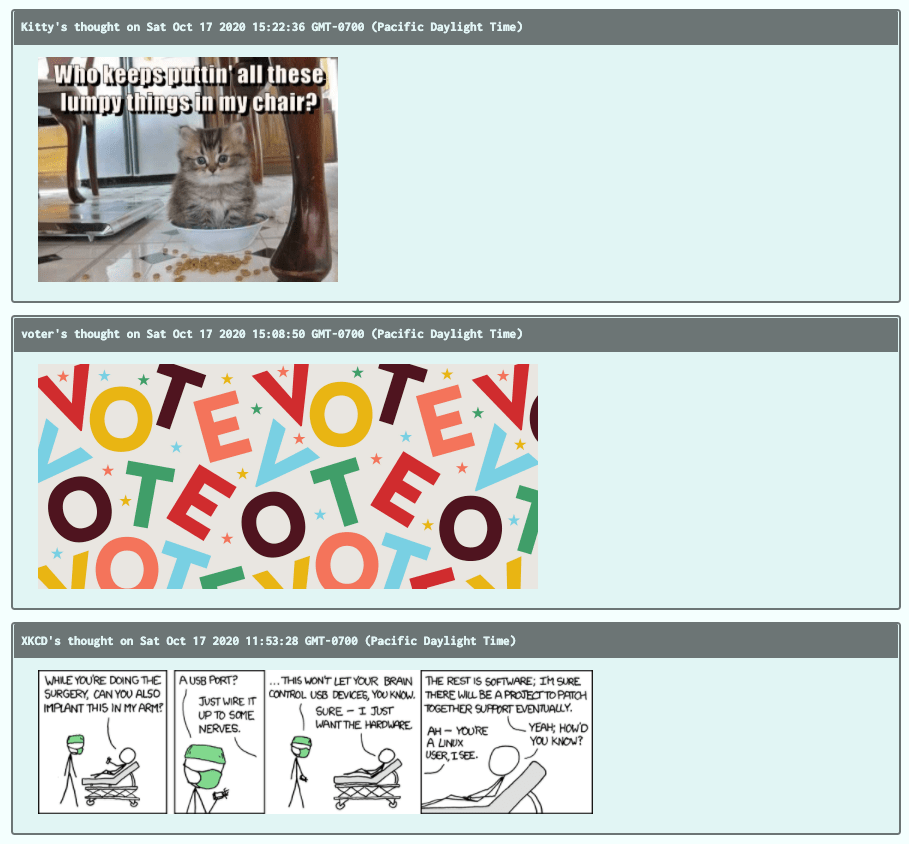

# aws-thought

    

## Description

AWS-Thought is a social media application where users can post thoughts to a DynamoDB non-relational database hosted on AWS. Users can also upload images with their thoughts which are uploaded to an S3 bucket on AWS. The application is hosted on an EC2 instance running unbuntu 20.04.2 LTS. 

## Table of Contents:
* [installation](#installation)
* [usage](#usage)
* [screenshot](#screenshot)
* [credits](#credits)

## Installation 

To run this project in development on your local machine, you will need to create a local instance of DynamoDB. 

## Usage 

Navigate to the hosted URL <link> and begin uploading your thoughts and images to the deployed application! 

## Screenshot

      

## Credits

UT Coding Bootcamp Continuing Education. 

## License 

MIT
